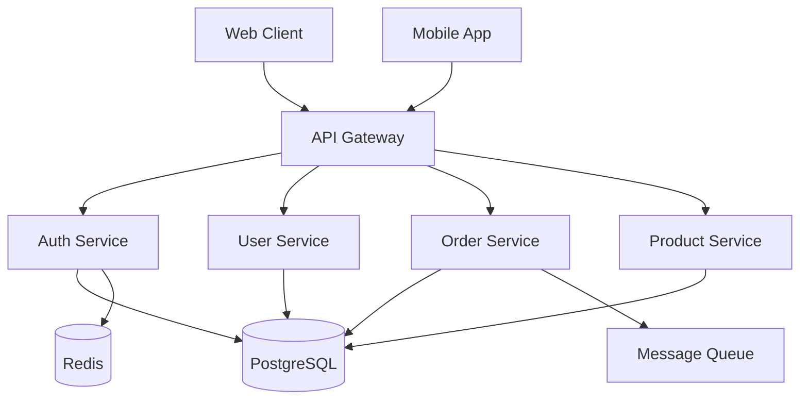

# Day 3 - Block 7: Real-world Projects with Sub-agents
## Learning Objectives
- Build complete applications using sub-agents
- Implement production-ready API generation
- Design database schema evolution systems
- Create comprehensive test suite generators
- Automate documentation workflows

## Building a Complete E-commerce Platform

### Full-Stack E-commerce Generator

```bash
#!/bin/bash
# ecommerce-platform.sh

claude-code "Build complete e-commerce platform:

PROJECT: ModernEcommerce
STACK: Next.js + Node.js + PostgreSQL + Redis

PHASE 1: Database Architecture
Sub-agent: DatabaseArchitect

Create comprehensive schema:
-- Core Tables
CREATE TABLE users (
  id UUID PRIMARY KEY,
  email VARCHAR(255) UNIQUE,
  password_hash VARCHAR(255),
  role ENUM('customer', 'admin', 'vendor'),
  created_at TIMESTAMP DEFAULT NOW()
);

CREATE TABLE products (
  id UUID PRIMARY KEY,
  vendor_id UUID REFERENCES users(id),
  name VARCHAR(255),
  description TEXT,
  price DECIMAL(10,2),
  inventory INTEGER,
  category_id UUID,
  tags JSONB,
  images JSONB,
  attributes JSONB
);

CREATE TABLE orders (
  id UUID PRIMARY KEY,
  user_id UUID REFERENCES users(id),
  status ENUM('pending', 'processing', 'shipped', 'delivered'),
  total DECIMAL(10,2),
  shipping_address JSONB,
  payment_method JSONB,
  created_at TIMESTAMP
);

CREATE TABLE order_items (
  id UUID PRIMARY KEY,
  order_id UUID REFERENCES orders(id),
  product_id UUID REFERENCES products(id),
  quantity INTEGER,
  price DECIMAL(10,2),
  discount DECIMAL(10,2)
);

-- Additional tables for cart, reviews, wishlist, etc.

PHASE 2: Backend API Development
Sub-agent: APIBuilder

Generate REST & GraphQL APIs:

/backend/src/api/
├── auth/
│   ├── register.ts
│   ├── login.ts
│   ├── refresh.ts
│   └── logout.ts
├── products/
│   ├── search.ts      // Elasticsearch integration
│   ├── filter.ts      // Advanced filtering
│   ├── recommend.ts   // ML recommendations
│   └── crud.ts
├── orders/
│   ├── checkout.ts    // Payment processing
│   ├── tracking.ts    // Shipment tracking
│   └── history.ts
├── cart/
│   ├── add.ts
│   ├── update.ts
│   ├── sync.ts        // Multi-device sync
│   └── checkout.ts
└── admin/
    ├── dashboard.ts
    ├── analytics.ts
    └── inventory.ts

GraphQL Schema:
type Product {
  id: ID!
  name: String!
  price: Float!
  images: [Image!]!
  reviews: [Review!]!
  recommendations: [Product!]!
}

type Query {
  product(id: ID!): Product
  products(filter: ProductFilter): [Product!]!
  search(query: String!): SearchResult!
}

type Mutation {
  addToCart(productId: ID!, quantity: Int!): Cart!
  checkout(input: CheckoutInput!): Order!
}

PHASE 3: Frontend Application
Sub-agent: FrontendBuilder

Create Next.js 14 app with:

/frontend/app/
├── (shop)/
│   ├── page.tsx           // Homepage
│   ├── products/
│   │   ├── page.tsx        // Product listing
│   │   └── [id]/page.tsx   // Product detail
│   ├── cart/
│   │   └── page.tsx        // Shopping cart
│   └── checkout/
│       ├── page.tsx        // Checkout flow
│       └── success/page.tsx
├── (account)/
│   ├── profile/page.tsx
│   ├── orders/page.tsx
│   └── wishlist/page.tsx
└── (admin)/
    ├── dashboard/page.tsx
    ├── products/page.tsx
    └── orders/page.tsx

Components:
/frontend/components/
├── product/
│   ├── ProductCard.tsx
│   ├── ProductGallery.tsx
│   ├── ProductReviews.tsx
│   └── ProductFilters.tsx
├── cart/
│   ├── CartDrawer.tsx
│   ├── CartItem.tsx
│   └── CartSummary.tsx
├── checkout/
│   ├── ShippingForm.tsx
│   ├── PaymentForm.tsx
│   └── OrderReview.tsx
└── ui/
    ├── Button.tsx
    ├── Input.tsx
    └── Modal.tsx

PHASE 4: Payment Integration
Sub-agent: PaymentIntegrator

Integrate multiple payment providers:
- Stripe for cards
- PayPal for express checkout
- Cryptocurrency support
- Buy now, pay later options

Implementation:
class PaymentService {
  async processPayment(order, method) {
    switch(method.type) {
      case 'stripe':
        return this.processStripe(order, method);
      case 'paypal':
        return this.processPayPal(order, method);
      case 'crypto':
        return this.processCrypto(order, method);
    }
  }
  
  async handleWebhook(provider, payload) {
    // Verify webhook signature
    // Update order status
    // Send confirmation email
    // Update inventory
  }
}

PHASE 5: Search & Recommendations
Sub-agent: SearchOptimizer

Implement advanced search:
- Elasticsearch for full-text search
- Algolia for instant search
- AI-powered recommendations
- Personalization engine

const searchService = {
  async search(query, filters) {
    // Elasticsearch query
    const results = await elastic.search({
      index: 'products',
      body: {
        query: {
          bool: {
            must: [
              { match: { name: query } },
              ...buildFilters(filters)
            ]
          }
        },
        aggs: {
          categories: { terms: { field: 'category' } },
          price_ranges: { histogram: { field: 'price' } }
        }
      }
    });
    
    return formatResults(results);
  },
  
  async getRecommendations(userId, productId) {
    // ML-based recommendations
    const userProfile = await getUserProfile(userId);
    const similar = await findSimilarProducts(productId);
    const trending = await getTrendingProducts();
    
    return combineRecommendations(userProfile, similar, trending);
  }
};

PHASE 6: Performance Optimization
Sub-agent: PerformanceOptimizer

Implement optimizations:
- Image optimization with Next.js Image
- Code splitting and lazy loading
- Redis caching for sessions and cart
- CDN for static assets
- Database query optimization
- API response caching

PHASE 7: Testing Suite
Sub-agent: TestGenerator

Create comprehensive tests:
- Unit tests for all services
- Integration tests for API endpoints
- E2E tests for user flows
- Performance tests
- Security tests

PHASE 8: DevOps & Deployment
Sub-agent: DevOpsEngineer

Setup infrastructure:
- Docker containers
- Kubernetes deployment
- CI/CD with GitHub Actions
- Monitoring with Datadog
- Error tracking with Sentry
- Auto-scaling policies

VALIDATION & LAUNCH:
- Load testing with 10,000 concurrent users
- Security audit
- SEO optimization
- Analytics integration
- Production deployment"
```

## API Generation Workflow

### Complete REST API Generator

```bash
#!/bin/bash
# api-generator.sh

claude-code "Generate production REST API:

PROJECT: EnterpriseAPI
SPEC: OpenAPI 3.0

STEP 1: API Design
Sub-agent: APIDesigner

Generate OpenAPI specification:
openapi: 3.0.0
info:
  title: Enterprise API
  version: 1.0.0
  
paths:
  /api/v1/resources:
    get:
      summary: List resources
      parameters:
        - name: page
          in: query
          schema:
            type: integer
        - name: limit
          in: query
          schema:
            type: integer
      responses:
        200:
          description: Success
          content:
            application/json:
              schema:
                type: object
                properties:
                  data:
                    type: array
                    items:
                      $ref: '#/components/schemas/Resource'
                  meta:
                    $ref: '#/components/schemas/Pagination'
    
    post:
      summary: Create resource
      requestBody:
        required: true
        content:
          application/json:
            schema:
              $ref: '#/components/schemas/ResourceInput'
      responses:
        201:
          description: Created
          
  /api/v1/resources/{id}:
    get:
      summary: Get resource by ID
      parameters:
        - name: id
          in: path
          required: true
          schema:
            type: string
    put:
      summary: Update resource
    delete:
      summary: Delete resource

components:
  schemas:
    Resource:
      type: object
      properties:
        id: 
          type: string
        name:
          type: string
        metadata:
          type: object
          
  securitySchemes:
    bearerAuth:
      type: http
      scheme: bearer
      bearerFormat: JWT

STEP 2: Controller Generation
Sub-agent: ControllerBuilder

Generate Express controllers:

// ResourceController.ts
export class ResourceController {
  constructor(
    private resourceService: ResourceService,
    private validator: Validator,
    private logger: Logger
  ) {}
  
  @Get('/')
  @UseMiddleware(authenticate, paginate)
  async list(req: Request, res: Response) {
    try {
      const filters = this.validator.validateFilters(req.query);
      const resources = await this.resourceService.list(filters);
      
      return res.json({
        data: resources,
        meta: getPaginationMeta(req, resources)
      });
    } catch (error) {
      this.logger.error('Failed to list resources', error);
      throw new ApiError('Failed to fetch resources', 500);
    }
  }
  
  @Post('/')
  @UseMiddleware(authenticate, authorize('create'))
  @ValidateBody(ResourceSchema)
  async create(req: Request, res: Response) {
    const resource = await this.resourceService.create(req.body);
    
    res.status(201).json({
      data: resource,
      message: 'Resource created successfully'
    });
  }
  
  @Get('/:id')
  @UseMiddleware(authenticate, cacheResponse(300))
  async getById(req: Request, res: Response) {
    const resource = await this.resourceService.findById(req.params.id);
    
    if (!resource) {
      throw new NotFoundError('Resource not found');
    }
    
    return res.json({ data: resource });
  }
  
  @Put('/:id')
  @UseMiddleware(authenticate, authorize('update'))
  @ValidateBody(ResourceUpdateSchema)
  async update(req: Request, res: Response) {
    const updated = await this.resourceService.update(
      req.params.id,
      req.body
    );
    
    return res.json({
      data: updated,
      message: 'Resource updated successfully'
    });
  }
  
  @Delete('/:id')
  @UseMiddleware(authenticate, authorize('delete'))
  async delete(req: Request, res: Response) {
    await this.resourceService.delete(req.params.id);
    
    return res.status(204).send();
  }
}

STEP 3: Service Layer
Sub-agent: ServiceBuilder

Generate business logic layer:

// ResourceService.ts
export class ResourceService {
  constructor(
    private repository: ResourceRepository,
    private cache: CacheService,
    private eventBus: EventBus
  ) {}
  
  async list(filters: FilterOptions): Promise<Resource[]> {
    const cacheKey = this.getCacheKey('list', filters);
    
    // Check cache
    const cached = await this.cache.get(cacheKey);
    if (cached) return cached;
    
    // Fetch from database
    const resources = await this.repository.findAll(filters);
    
    // Cache results
    await this.cache.set(cacheKey, resources, 300);
    
    return resources;
  }
  
  async create(data: CreateResourceDto): Promise<Resource> {
    // Validate business rules
    await this.validateBusinessRules(data);
    
    // Create resource
    const resource = await this.repository.create(data);
    
    // Emit event
    await this.eventBus.emit('resource.created', resource);
    
    // Invalidate cache
    await this.cache.invalidate('list:*');
    
    return resource;
  }
  
  async update(id: string, data: UpdateResourceDto): Promise<Resource> {
    const resource = await this.repository.findById(id);
    
    if (!resource) {
      throw new NotFoundError('Resource not found');
    }
    
    // Check version for optimistic locking
    if (data.version !== resource.version) {
      throw new ConflictError('Resource has been modified');
    }
    
    // Update resource
    const updated = await this.repository.update(id, data);
    
    // Emit event
    await this.eventBus.emit('resource.updated', { old: resource, new: updated });
    
    // Update cache
    await this.cache.set(`resource:${id}`, updated);
    
    return updated;
  }
}

STEP 4: Middleware Stack
Sub-agent: MiddlewareBuilder

Generate middleware:

// Authentication
export const authenticate = async (req, res, next) => {
  const token = req.headers.authorization?.split(' ')[1];
  
  if (!token) {
    return res.status(401).json({ error: 'No token provided' });
  }
  
  try {
    const payload = jwt.verify(token, process.env.JWT_SECRET);
    req.user = await userService.findById(payload.userId);
    next();
  } catch (error) {
    return res.status(401).json({ error: 'Invalid token' });
  }
};

// Rate limiting
export const rateLimit = createRateLimiter({
  windowMs: 15 * 60 * 1000, // 15 minutes
  max: 100, // limit each IP to 100 requests per windowMs
  message: 'Too many requests',
  standardHeaders: true,
  legacyHeaders: false,
});

// Request validation
export const validateBody = (schema) => {
  return (req, res, next) => {
    const { error } = schema.validate(req.body);
    
    if (error) {
      return res.status(400).json({
        error: 'Validation failed',
        details: error.details
      });
    }
    
    next();
  };
};

// Error handling
export const errorHandler = (err, req, res, next) => {
  logger.error(err);
  
  if (err instanceof ApiError) {
    return res.status(err.statusCode).json({
      error: err.message,
      code: err.code
    });
  }
  
  return res.status(500).json({
    error: 'Internal server error'
  });
};

STEP 5: Database Layer
Sub-agent: RepositoryBuilder

Generate repository pattern:

// ResourceRepository.ts
export class ResourceRepository {
  constructor(private db: Database) {}
  
  async findAll(filters: FilterOptions): Promise<Resource[]> {
    const query = this.db
      .select('*')
      .from('resources')
      .where(filters.where || {})
      .orderBy(filters.orderBy || 'created_at')
      .limit(filters.limit || 50)
      .offset(filters.offset || 0);
    
    return query.execute();
  }
  
  async findById(id: string): Promise<Resource | null> {
    return this.db
      .select('*')
      .from('resources')
      .where({ id })
      .first();
  }
  
  async create(data: CreateResourceDto): Promise<Resource> {
    const [resource] = await this.db
      .insert(data)
      .into('resources')
      .returning('*');
    
    return resource;
  }
  
  async update(id: string, data: UpdateResourceDto): Promise<Resource> {
    const [updated] = await this.db
      .update(data)
      .table('resources')
      .where({ id })
      .returning('*');
    
    return updated;
  }
  
  async delete(id: string): Promise<void> {
    await this.db
      .delete()
      .from('resources')
      .where({ id });
  }
}

STEP 6: Testing
Sub-agent: APITester

Generate comprehensive tests:

describe('Resource API', () => {
  describe('GET /api/v1/resources', () => {
    it('should return paginated resources', async () => {
      const response = await request(app)
        .get('/api/v1/resources?page=1&limit=10')
        .set('Authorization', `Bearer ${token}`)
        .expect(200);
      
      expect(response.body.data).toBeArray();
      expect(response.body.meta.page).toBe(1);
    });
  });
  
  describe('POST /api/v1/resources', () => {
    it('should create new resource', async () => {
      const resource = { name: 'Test Resource' };
      
      const response = await request(app)
        .post('/api/v1/resources')
        .set('Authorization', `Bearer ${token}`)
        .send(resource)
        .expect(201);
      
      expect(response.body.data.name).toBe(resource.name);
    });
  });
});

DEPLOYMENT:
- Generate Docker container
- Create Kubernetes manifests
- Setup API gateway
- Configure monitoring
- Deploy to cloud"
```

## Database Schema Evolution

### Automated Migration System

```bash
#!/bin/bash
# schema-evolution.sh

claude-code "Implement database schema evolution:

SYSTEM: SchemaEvolutionManager

MIGRATION WORKFLOW:

Step 1: Schema Analysis
Sub-agent: SchemaAnalyzer

Analyze current schema:
- Extract table definitions
- Map relationships
- Identify indexes
- Document constraints
- Check data types

Step 2: Migration Generation
Sub-agent: MigrationGenerator

Generate migration files:

// Migration: 001_add_user_profiles.js
export async function up(knex) {
  await knex.schema.createTable('user_profiles', table => {
    table.uuid('id').primary();
    table.uuid('user_id').references('users.id').onDelete('CASCADE');
    table.string('first_name', 100);
    table.string('last_name', 100);
    table.date('birth_date');
    table.jsonb('preferences');
    table.timestamps(true, true);
    
    table.index('user_id');
  });
  
  // Migrate existing data
  await knex.raw(`
    INSERT INTO user_profiles (id, user_id, created_at)
    SELECT gen_random_uuid(), id, NOW()
    FROM users
    WHERE NOT EXISTS (
      SELECT 1 FROM user_profiles WHERE user_id = users.id
    )
  `);
}

export async function down(knex) {
  await knex.schema.dropTable('user_profiles');
}

Step 3: Safe Migration Execution
Sub-agent: MigrationExecutor

class SafeMigrationRunner {
  async run(migration) {
    const backup = await this.createBackup();
    
    try {
      // Start transaction
      await this.db.transaction(async trx => {
        // Run migration
        await migration.up(trx);
        
        // Validate schema
        await this.validateSchema(trx);
        
        // Test queries
        await this.testQueries(trx);
      });
      
      // Success - commit
      await this.recordMigration(migration);
      
    } catch (error) {
      // Rollback
      await this.restoreBackup(backup);
      throw error;
    }
  }
  
  async validateSchema(trx) {
    // Check constraints
    const constraints = await trx.raw(`
      SELECT * FROM information_schema.table_constraints
      WHERE constraint_schema = 'public'
    `);
    
    // Validate foreign keys
    const foreignKeys = await trx.raw(`
      SELECT * FROM information_schema.referential_constraints
    `);
    
    // Check indexes
    const indexes = await trx.raw(`
      SELECT * FROM pg_indexes
      WHERE schemaname = 'public'
    `);
    
    return this.analyzeSchemaHealth(constraints, foreignKeys, indexes);
  }
}

Step 4: Zero-Downtime Migrations
Sub-agent: ZeroDowntimeOrchestrator

Implement blue-green migration:

async function zeroDowntimeMigration() {
  // Phase 1: Add new columns (backward compatible)
  await addNewColumns();
  
  // Phase 2: Dual write (old and new)
  await enableDualWrite();
  
  // Phase 3: Backfill data
  await backfillInBatches();
  
  // Phase 4: Switch reads to new columns
  await switchReads();
  
  // Phase 5: Stop writing to old columns
  await disableOldWrites();
  
  // Phase 6: Drop old columns
  await dropOldColumns();
}

async function backfillInBatches() {
  const batchSize = 1000;
  let offset = 0;
  
  while (true) {
    const batch = await db
      .select('id')
      .from('large_table')
      .limit(batchSize)
      .offset(offset);
    
    if (batch.length === 0) break;
    
    await db.transaction(async trx => {
      for (const row of batch) {
        await trx('large_table')
          .where('id', row.id)
          .update({
            new_column: calculateNewValue(row)
          });
      }
    });
    
    offset += batchSize;
    
    // Throttle to avoid overload
    await sleep(100);
  }
}

Step 5: Schema Versioning
Sub-agent: VersionManager

Track schema versions:

CREATE TABLE schema_versions (
  version INTEGER PRIMARY KEY,
  name VARCHAR(255),
  executed_at TIMESTAMP,
  execution_time INTEGER,
  checksum VARCHAR(64)
);

class SchemaVersionManager {
  async getCurrentVersion() {
    const result = await db
      .select('version')
      .from('schema_versions')
      .orderBy('version', 'desc')
      .first();
    
    return result?.version || 0;
  }
  
  async applyMigrations(targetVersion) {
    const current = await this.getCurrentVersion();
    const migrations = await this.getMigrations(current, targetVersion);
    
    for (const migration of migrations) {
      await this.applyMigration(migration);
    }
  }
  
  async rollback(targetVersion) {
    const current = await this.getCurrentVersion();
    const migrations = await this.getMigrations(targetVersion, current);
    
    for (const migration of migrations.reverse()) {
      await this.rollbackMigration(migration);
    }
  }
}"
```

## Test Suite Generation

### Comprehensive Test Generator

```bash
#!/bin/bash
# test-suite-generator.sh

claude-code "Generate complete test suite:

PROJECT: FullTestCoverage

UNIT TEST GENERATION:
Sub-agent: UnitTestGenerator

Generate tests for every function:

// userService.test.ts
describe('UserService', () => {
  let userService: UserService;
  let mockRepository: jest.Mocked<UserRepository>;
  
  beforeEach(() => {
    mockRepository = createMockRepository();
    userService = new UserService(mockRepository);
  });
  
  describe('createUser', () => {
    it('should create user with valid data', async () => {
      const userData = {
        email: 'test@example.com',
        password: 'SecurePass123!'
      };
      
      mockRepository.create.mockResolvedValue({
        id: '123',
        ...userData
      });
      
      const user = await userService.createUser(userData);
      
      expect(user.id).toBe('123');
      expect(user.email).toBe(userData.email);
      expect(mockRepository.create).toHaveBeenCalledWith(
        expect.objectContaining({
          email: userData.email,
          password: expect.any(String) // hashed
        })
      );
    });
    
    it('should throw on duplicate email', async () => {
      mockRepository.create.mockRejectedValue(
        new UniqueConstraintError('email')
      );
      
      await expect(
        userService.createUser({ email: 'existing@example.com' })
      ).rejects.toThrow('Email already exists');
    });
    
    it('should validate email format', async () => {
      await expect(
        userService.createUser({ email: 'invalid-email' })
      ).rejects.toThrow('Invalid email format');
    });
  });
});

INTEGRATION TEST GENERATION:
Sub-agent: IntegrationTestGenerator

Test API endpoints:

// api.integration.test.ts
describe('API Integration Tests', () => {
  let app: Application;
  let db: Database;
  
  beforeAll(async () => {
    app = await createTestApp();
    db = await createTestDatabase();
  });
  
  afterEach(async () => {
    await db.truncate(['users', 'orders', 'products']);
  });
  
  describe('Order Flow', () => {
    it('should complete full order flow', async () => {
      // 1. Register user
      const userResponse = await request(app)
        .post('/api/auth/register')
        .send({
          email: 'customer@test.com',
          password: 'Test123!'
        })
        .expect(201);
      
      const token = userResponse.body.token;
      
      // 2. Add product to cart
      await request(app)
        .post('/api/cart/add')
        .set('Authorization', `Bearer ${token}`)
        .send({
          productId: 'test-product-1',
          quantity: 2
        })
        .expect(200);
      
      // 3. Checkout
      const orderResponse = await request(app)
        .post('/api/orders/checkout')
        .set('Authorization', `Bearer ${token}`)
        .send({
          shippingAddress: { ... },
          paymentMethod: { ... }
        })
        .expect(201);
      
      // 4. Verify order created
      const order = await db
        .select('*')
        .from('orders')
        .where('id', orderResponse.body.orderId)
        .first();
      
      expect(order.status).toBe('pending');
      expect(order.total).toBe(199.98);
    });
  });
});

E2E TEST GENERATION:
Sub-agent: E2ETestGenerator

Generate Playwright tests:

// e2e/checkout.spec.ts
import { test, expect } from '@playwright/test';

test.describe('Checkout Flow', () => {
  test('should complete purchase', async ({ page }) => {
    // Navigate to product
    await page.goto('/products/laptop');
    
    // Add to cart
    await page.click('[data-testid=\"add-to-cart\"]');
    await expect(page.locator('[data-testid=\"cart-count\"]'))
      .toHaveText('1');
    
    // Go to cart
    await page.click('[data-testid=\"cart-icon\"]');
    await expect(page).toHaveURL('/cart');
    
    // Proceed to checkout
    await page.click('[data-testid=\"checkout-button\"]');
    
    // Fill shipping info
    await page.fill('[name=\"firstName\"]', 'John');
    await page.fill('[name=\"lastName\"]', 'Doe');
    await page.fill('[name=\"address\"]', '123 Main St');
    
    // Fill payment info
    await page.fill('[name=\"cardNumber\"]', '4242424242424242');
    await page.fill('[name=\"expiry\"]', '12/25');
    await page.fill('[name=\"cvv\"]', '123');
    
    // Complete order
    await page.click('[data-testid=\"place-order\"]');
    
    // Verify success
    await expect(page).toHaveURL(/\\/order\\/success/);
    await expect(page.locator('h1'))
      .toHaveText('Order Confirmed!');
  });
});

PERFORMANCE TEST GENERATION:
Sub-agent: PerformanceTestGenerator

Generate load tests:

// k6/load-test.js
import http from 'k6/http';
import { check, sleep } from 'k6';

export const options = {
  stages: [
    { duration: '2m', target: 100 },  // Ramp up
    { duration: '5m', target: 100 },  // Stay at 100
    { duration: '2m', target: 200 },  // Ramp to 200
    { duration: '5m', target: 200 },  // Stay at 200
    { duration: '2m', target: 0 },    // Ramp down
  ],
  thresholds: {
    http_req_duration: ['p(95)<500'], // 95% under 500ms
    http_req_failed: ['rate<0.1'],    // Error rate < 10%
  },
};

export default function () {
  // Login
  const loginRes = http.post(
    'http://api.example.com/auth/login',
    JSON.stringify({
      email: 'test@example.com',
      password: 'password'
    })
  );
  
  check(loginRes, {
    'login successful': (r) => r.status === 200,
  });
  
  const token = loginRes.json('token');
  
  // Browse products
  const productsRes = http.get(
    'http://api.example.com/products',
    {
      headers: { Authorization: `Bearer ${token}` }
    }
  );
  
  check(productsRes, {
    'products loaded': (r) => r.status === 200,
  });
  
  sleep(1);
}

TEST COVERAGE ANALYSIS:
Sub-agent: CoverageAnalyzer

Ensure comprehensive coverage:
- Line coverage: > 90%
- Branch coverage: > 85%
- Function coverage: > 95%
- Critical paths: 100%

Generate coverage report with gaps analysis"
```

## Documentation Automation

### Complete Documentation System

```bash
#!/bin/bash
# documentation-system.sh

claude-code "Build automated documentation system:

SYSTEM: DocumentationAutomator

API DOCUMENTATION:
Sub-agent: APIDocGenerator

Generate from code:

/**
 * @api {post} /api/users Create User
 * @apiName CreateUser
 * @apiGroup Users
 * @apiVersion 1.0.0
 * 
 * @apiParam {String} email User's email address
 * @apiParam {String} password User's password (min 8 chars)
 * @apiParam {String} [firstName] User's first name
 * @apiParam {String} [lastName] User's last name
 * 
 * @apiSuccess {String} id User's unique ID
 * @apiSuccess {String} email User's email
 * @apiSuccess {String} token Authentication token
 * 
 * @apiError (400) ValidationError Invalid input data
 * @apiError (409) ConflictError Email already exists
 * 
 * @apiExample {curl} Example:
 *   curl -X POST http://api.example.com/api/users \\
 *     -H \"Content-Type: application/json\" \\
 *     -d '{\"email\":\"user@example.com\",\"password\":\"SecurePass123\"}'
 */

Generate interactive docs with Swagger UI

ARCHITECTURE DOCUMENTATION:
Sub-agent: ArchitectureDocumenter

Create diagrams and descriptions:

# System Architecture

## Overview


## Services

### Authentication Service
- **Purpose**: Handle user authentication and authorization
- **Technology**: Node.js, JWT, bcrypt
- **Database**: PostgreSQL (users, sessions, roles)
- **Cache**: Redis for session storage
- **Endpoints**:
  - POST /auth/login
  - POST /auth/register
  - POST /auth/refresh
  - POST /auth/logout

### Order Service
- **Purpose**: Manage order lifecycle
- **Technology**: Node.js, Express
- **Database**: PostgreSQL (orders, order_items)
- **Queue**: RabbitMQ for order processing
- **Integrations**: Payment service, Inventory service

DEVELOPER GUIDE:
Sub-agent: GuideGenerator

Create comprehensive guides:

# Developer Guide

## Getting Started

### Prerequisites
- Node.js 18+
- PostgreSQL 14+
- Redis 6+
- Docker Desktop

### Installation
```bash
# Clone repository
git clone https://github.com/company/project.git

# Install dependencies
npm install

# Setup environment
cp .env.example .env

# Run migrations
npm run db:migrate

# Seed database
npm run db:seed

# Start development server
npm run dev
```

## Development Workflow

### Creating a New Feature
1. Create feature branch
2. Implement feature with TDD
3. Update documentation
4. Submit PR with tests

### Code Style
- Use ESLint configuration
- Follow naming conventions
- Write self-documenting code

## Testing
```bash
# Unit tests
npm test

# Integration tests
npm run test:integration

# E2E tests
npm run test:e2e

# Coverage report
npm run test:coverage
```

README GENERATOR:
Sub-agent: ReadmeBuilder

Generate professional README:

# Project Name


## Description
Brief project description

## Features
- ✅ Feature 1
- ✅ Feature 2
- ✅ Feature 3

## Quick Start
```bash
npm install
npm run dev
```

## Documentation
- [API Documentation](./docs/api.md)
- [Architecture](./docs/architecture.md)
- [Contributing](./CONTRIBUTING.md)

## License
MIT

CHANGELOG AUTOMATION:
Sub-agent: ChangelogGenerator

Generate from commits:

# Changelog

## [2.0.0] - 2024-01-15

### Breaking Changes
- Changed API response format
- Removed deprecated endpoints

### Features
- Added multi-tenant support
- Implemented real-time notifications
- Added GraphQL API

### Bug Fixes
- Fixed memory leak in cache service
- Resolved race condition in order processing

### Performance
- Improved query performance by 50%
- Reduced bundle size by 30%"
```

## Practice Exercises

### Exercise 1: Build a Social Media Platform
Create a complete social media application with posts, comments, likes, real-time chat, and notifications using sub-agents.

### Exercise 2: Design a Banking System
Build a secure banking application with accounts, transactions, fraud detection, and regulatory compliance using sub-agents.

### Exercise 3: Create a Learning Management System
Develop an LMS with courses, quizzes, progress tracking, and video streaming using sub-agents.

## Key Takeaways

1. **Real-world projects** require coordinated sub-agent systems
2. **API generation** can be fully automated with proper specifications
3. **Database evolution** must be handled with zero-downtime strategies
4. **Test generation** ensures comprehensive coverage automatically
5. **Documentation automation** keeps docs in sync with code
6. **Production systems** need monitoring, scaling, and error handling

## Next Steps

Block 8 will explore custom workflows, industry-specific sub-agents, and domain-driven design patterns.